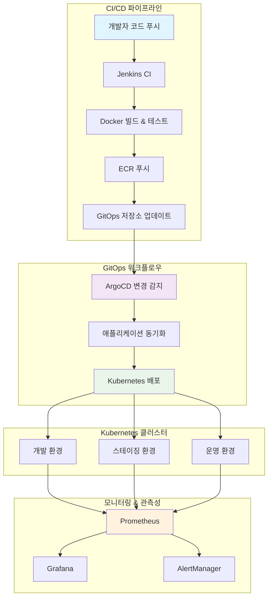
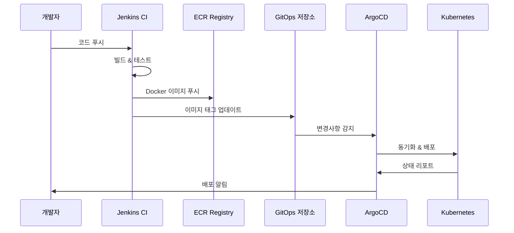

# 🚀 마이크로서비스 GitOps 플랫폼

[](https://argoproj.github.io/cd/)
[](https://kubernetes.io/)
[](https://kustomize.io/)

**Elice DevOps 마이크로서비스 플랫폼을 위한 GitOps 기반 배포 매니페스트 저장소**

ArgoCD와 Kubernetes를 활용한 선언적 배포 관리 시스템입니다.

## 🎯 프로젝트 개요

이 저장소는 **GitOps 원칙**을 따라 클라우드 네이티브 마이크로서비스 플랫폼의 배포와 관리를 위한 Kubernetes 매니페스트와 ArgoCD 애플리케이션을 포함합니다. 모든 인프라와 애플리케이션 배포가 선언적으로 정의되어 자동으로 동기화됩니다.

## 🏗️ 시스템 아키텍처



## 📂 저장소 구조

```
microservices-gitops/
├── 📁 applications/              # 애플리케이션 매니페스트
│   ├── api-gateway/
│   │   ├── base/                 # 기본 Kustomize 리소스
│   │   │   ├── deployment.yaml
│   │   │   ├── service.yaml
│   │   │   └── kustomization.yaml
│   │   └── overlays/             # 환경별 오버레이
│   │       ├── dev/
│   │       ├── staging/
│   │       └── production/
│   ├── auth-service/
│   ├── user-service/
│   └── ...
├── 📁 infrastructure/            # 인프라 구성요소
│   ├── argocd/
│   │   ├── applications/         # ArgoCD 애플리케이션 정의
│   │   ├── projects/             # ArgoCD 프로젝트 정의
│   │   └── repositories/         # 저장소 설정
│   ├── monitoring/
│   │   ├── prometheus/
│   │   └── grafana/
│   └── networking/
│       ├── ingress/
│       └── service-mesh/
├── 📁 environments/              # 환경별 설정
│   ├── dev/
│   ├── staging/
│   └── production/
├── 📁 scripts/                   # 자동화 스크립트
│   ├── update-image.sh
│   ├── sync-manifests.sh
│   └── validate-manifests.sh
└── 📁 docs/                      # 문서
    ├── deployment-guide.md
    ├── troubleshooting.md
    └── architecture.md
```

## 🎯 GitOps 워크플로우



## 🌍 환경 구성

| 환경 | 클러스터 | 용도 | ArgoCD 동기화 |
|------|----------|------|---------------|
| **개발환경** | `elice-dev` | 기능 개발 및 테스트 | 자동 |
| **스테이징** | `elice-stg` | 통합 테스트 및 QA | 수동 승인 |
| **운영환경** | `elice-prod` | 실제 서비스 운영 | 수동 승인 |

## 🛠️ 기술 스택

- **GitOps**: [ArgoCD](https://argoproj.github.io/cd/)
- **오케스트레이션**: [Kubernetes](https://kubernetes.io/)
- **템플릿 엔진**: [Kustomize](https://kustomize.io/)
- **CI/CD**: [Jenkins](https://jenkins.io/)
- **컨테이너 레지스트리**: [Amazon ECR](https://aws.amazon.com/ecr/)
- **모니터링**: [Prometheus](https://prometheus.io/) + [Grafana](https://grafana.com/)

## 🚀 빠른 시작

### 사전 요구사항

- Kubernetes 클러스터 (v1.28+)
- ArgoCD 설치 완료
- kubectl 설정 완료
- Kustomize (v5.0+)

### 1. ArgoCD 설치

```bash
kubectl create namespace argocd
kubectl apply -n argocd -f https://raw.githubusercontent.com/argoproj/argo-cd/stable/manifests/install.yaml
```

### 2. ArgoCD UI 접근

```bash
kubectl port-forward svc/argocd-server -n argocd 8080:443
```

### 3. 애플리케이션 배포

```bash
# 모든 애플리케이션 배포
kubectl apply -f infrastructure/argocd/applications/

# 특정 환경 배포
kubectl apply -f environments/dev/
```

## 📋 애플리케이션 관리

### 새로운 애플리케이션 추가

1. **기본 매니페스트 생성**:
   ```bash
   mkdir -p applications/new-service/base
   # deployment.yaml, service.yaml, kustomization.yaml 추가
   ```

2. **환경별 오버레이 생성**:
   ```bash
   mkdir -p applications/new-service/overlays/{dev,staging,production}
   # 환경별 설정 추가
   ```

3. **ArgoCD에 등록**:
   ```bash
   # ArgoCD 애플리케이션 매니페스트 추가
   # 클러스터에 적용
   ```

### 애플리케이션 이미지 업데이트

```bash
# Jenkins CI/CD를 통한 자동화
scripts/update-image.sh api-gateway v1.2.3 staging
```

## 🔧 환경 설정

### 환경변수

| 변수명 | 설명 | 예시 |
|--------|------|------|
| `IMAGE_TAG` | 컨테이너 이미지 태그 | `v1.2.3` |
| `REPLICAS` | 레플리카 수 | `3` |
| `NAMESPACE` | Kubernetes 네임스페이스 | `elice-microservices` |

### 리소스 사양

| 환경 | CPU 요청 | 메모리 요청 | CPU 제한 | 메모리 제한 |
|------|----------|-------------|----------|-------------|
| **개발** | 100m | 128Mi | 500m | 512Mi |
| **스테이징** | 250m | 256Mi | 1000m | 1Gi |
| **운영** | 500m | 512Mi | 2000m | 2Gi |

## 📊 모니터링

### 헬스 체크

- **Liveness Probe**: `/health`
- **Readiness Probe**: `/ready`
- **Startup Probe**: `/startup`

### 메트릭

- **Prometheus**: `http://service:8080/metrics`
- **Grafana 대시보드**: 각 서비스별 사전 구성
- **알람**: AlertManager를 통한 중요 메트릭 모니터링

## 🔐 보안

### RBAC

- 환경별 권한이 분리된 ArgoCD 프로젝트
- 최소 권한 원칙을 따르는 서비스 계정
- 파드 간 통신을 위한 네트워크 정책

### 시크릿 관리

```yaml
# AWS Secrets Manager를 통한 외부 시크릿 관리
apiVersion: external-secrets.io/v1beta1
kind: SecretStore
metadata:
  name: aws-secrets-manager
```

## 🚨 문제 해결

### 일반적인 문제들

1. **애플리케이션 동기화 실패**
   ```bash
   # ArgoCD 애플리케이션 상태 확인
   argocd app get api-gateway-dev
   ```

2. **이미지 풀 오류**
   ```bash
   # ECR 권한 확인
   kubectl describe pod <pod-name>
   ```

3. **설정 드리프트**
   ```bash
   # ArgoCD 강제 동기화
   argocd app sync api-gateway-dev --prune
   ```

## 🤝 기여하기

### 브랜치 전략

- `main` - 운영 준비 완료된 매니페스트
- `develop` - 스테이징용 통합 브랜치
- `feature/service-name` - 기능별 매니페스트
- `hotfix/issue-description` - 긴급 운영 수정

### 커밋 컨벤션

```
feat(api-gateway): 헬스체크 엔드포인트 추가
fix(auth-service): 운영환경 메모리 누수 해결
docs(readme): 배포 가이드 업데이트
```

## 📚 문서

- [📖 아키텍처 가이드](docs/architecture.md)
- [🚀 배포 가이드](docs/deployment-guide.md)
- [🔧 문제 해결](docs/troubleshooting.md)
- [📊 모니터링 설정](docs/monitoring.md)

## 🏷️ 태그 & 릴리스

- **태그**: 환경별 태그 (`dev-v1.2.3`, `prod-v1.2.3`)
- **릴리스**: 변경사항이 포함된 주요 버전 릴리스
- **롤백**: 빠른 롤백을 위한 태그된 버전들

## 📞 지원

- **이슈**: [GitHub Issues](https://github.com/dongkoony/microservices-gitops/issues)
- **토론**: [GitHub Discussions](https://github.com/dongkoony/microservices-gitops/discussions)
- **위키**: [프로젝트 위키](https://github.com/dongkoony/microservices-gitops/wiki)

---

## 📜 라이센스

이 프로젝트는 MIT 라이센스 하에 있습니다. 자세한 내용은 [LICENSE](LICENSE) 파일을 참조하세요.

## 🙏 감사의 말

- [ArgoCD 커뮤니티](https://github.com/argoproj/argo-cd)
- [Kubernetes SIG Apps](https://github.com/kubernetes/community/tree/master/sig-apps)
- [CNCF GitOps 워킹 그룹](https://github.com/cncf/tag-app-delivery)

---

<div align="center">

**클라우드 네이티브 DevOps를 위해 ❤️ 로 제작되었습니다**

[](https://argoproj.github.io/cd/)
[](https://kubernetes.io/)

</div>